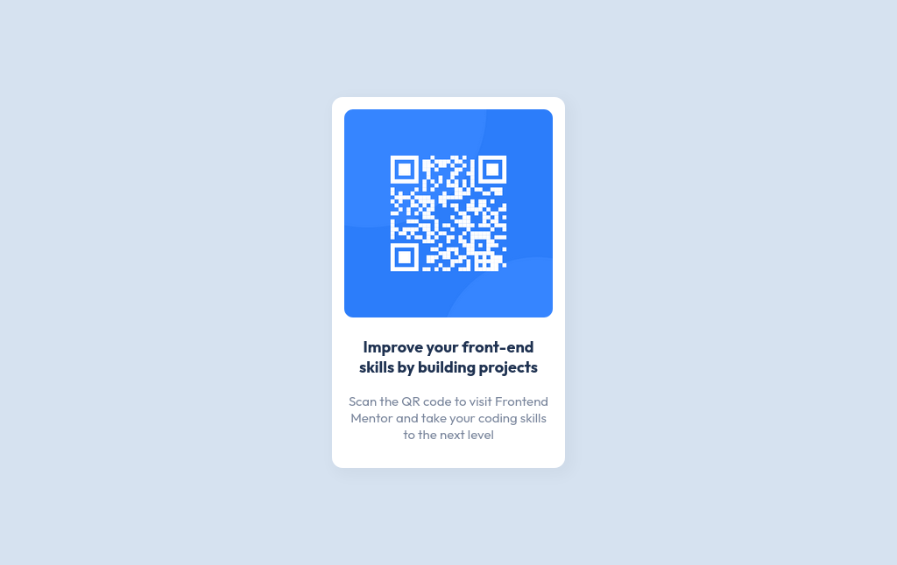

# Frontend Mentor - QR code component solution

This is a solution to the [QR code component challenge on Frontend Mentor](https://www.frontendmentor.io/challenges/qr-code-component-iux_sIO_H). Frontend Mentor challenges help you improve your coding skills by building realistic projects.

## Table of contents

- [Overview](#overview)
  - [Screenshot](#screenshot)
  - [Links](#links)
- [My process](#my-process)
  - [Built with](#built-with)
  - [Continued development](#continued-development)
- [Author](#author)

## Overview

This is my first frontendmentor project

### Screenshot

#### Desktop

#### Mobile

### Links

- Solution URL: [Github](https://github.com/ak-chp1/fm_qr_code_component)
- Live Site URL: [Github Pages](https://ak-chp1.github.io/m_qr_code_component)

## My process

### Built with

- Semantic HTML5 markup
- CSS custom properties

### Continued development

I still have to wrok on box shadow of `#card` element. And also fix some centering issues.

## Author

- Name - Aayush Kumar
- Frontend Mentor - [@AK-CHP1](https://www.frontendmentor.io/profile/AK-CHP1)
